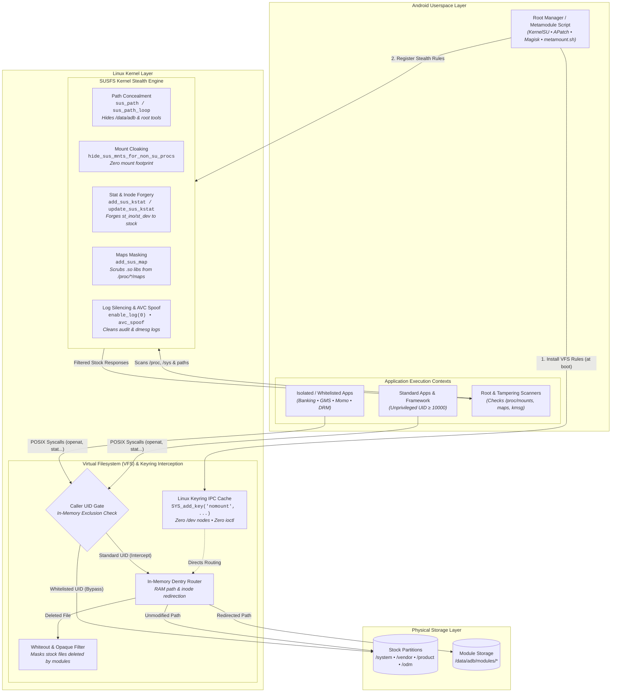

# 🛡️ BruhMount

> **Unified VFS Path Redirection & Automated Kernel SUSFS Metamodule**  
> *Zero Mount Table Footprint. Built-in Security Isolation. Pure RAM Redirection.*

[](https://github.com/nothingnesscore/BruhMount/actions/workflows/build.yml)
[](LICENSE)
[](https://source.android.com)
[](https://t.me/bruhperidot)

---

## 📖 Overview

**BruhMount** is an advanced Android **Metamodule** that unifies two core concepts in modern Android system modification:
1. **NoMount In-Memory VFS Redirection:** Replaces traditional OverlayFS / Magic Mount with dynamic, RAM-based VFS path interception via the Linux Keyring subsystem (`SYS_add_key`). It creates **0 mount points** in `/proc/mounts` and `/proc/self/mountinfo`.
2. **SUSFS Kernel Automation:** Eliminates the need for a separate `susfs4ksu` module by embedding the `ksu_susfs` control tool directly and automatically registering `/data/adb`, active module paths, and security spoofing at boot (compatible with SUSFS v1.5.0, v2.0.0, and v2.3.0+).

With **BruhMount**, your modules (audio mods, fonts, system tweaks, vendor overlays) function transparently, providing clean filesystem redirection and complete mount isolation without modifying underlying partitions.

---

## ✨ Key Features

* 🚀 **Zero Mount Table Footprint:** Traditional magic mount or overlay solutions create visible filesystem mounts that modify mount namespace records. BruhMount operates entirely in kernel RAM caches without adding any mount entries.
* 🔒 **Built-in SUSFS Automation:** When running on a kernel with SUSFS support (such as **BruhKernel** or compatible GKI builds), BruhMount automatically:
  * Registers `/data/adb` and `/data/adb/modules` with `susfs add_sus_path`.
  * Protects active module directories from unprivileged processes (UID ≥ 10000).
  * Automatically applies AVC denial log spoofing and masks module shared libraries (`.so`) from `/proc/self/maps`.
* 🔑 **Zero `/dev` Nodes or IOCTLs:** Metamodule communication with the kernel takes place via the Linux kernel Keyring subsystem (`SYS_add_key` with key type `"nomount"`), leaving no device files to manage.
* 📱 **Intuitive WebUI:** Inspect injected files, hot-load modules dynamically, and review active redirection rules directly from the KernelSU / APatch manager interface.
* 📁 **Partition Overlay Targeting:** Standard metamodule architecture—only modules containing partition file trees (`system`, `vendor`, `product`, etc.) are processed for VFS redirection. Pure script or service modules remain untouched.
* 🛡️ **Per-App UID Isolation:** Isolate specific applications by UID via the WebUI or CLI to bypass redirections, ensuring they interact strictly with the original stock filesystem.

---

## 🏗️ Architecture & How It Works



When an application accesses filesystem paths:
1. **Control Plane Initialization:** At early boot (`post-fs-data`), `metamount.sh` initializes the kernel driver, loads redirection rules into the Linux Keyring in RAM (`SYS_add_key`), and configures SUSFS kernel filters.
2. **UID Validation Gate:** When an app issues a filesystem syscall (`openat()`, `stat()`, `execve()`), BruhMount inspects the calling UID in kernel RAM. If isolated (e.g. Banking apps, Play Services, or user exclusions), it completely bypasses redirection and returns the stock partition file directly.
3. **In-Memory VFS Interception:** For standard applications, the kernel intercepts path resolution at the dentry layer in RAM via the Keyring table:
   - Modified module files redirect seamlessly to `/data/adb/modules/<mod>/...`.
   - Replaced/deleted files hit the whiteout filter, returning `ENOENT`.
   - Unmodified files pass through directly to stock partitions.
   - **Zero mount namespace entries** are created (`/proc/mounts` and `/proc/self/mountinfo` remain 100% clean).
4. **SUSFS Kernel Shielding:** Root directories (`/data/adb`), active modules, mount points (`sus_mount`), and injected shared libraries (`sus_map`) are cloaked from unprivileged processes (UID ≥ 10000), file status attributes (`sus_kstat`) forge stock filesystem inodes, and kernel logs (`enable_log 0`) are silenced.
5. **Resilient Recovery Engine:** If an incompatible module causes early boot instability, BruhMount automatically quarantines the culprit module on boot attempt #2, or drops into full safe mode on attempt #3 or via physical Volume-Down button hold.

---

## 📥 Installation

### Requirements
* **Root Solution:** KernelSU, SukiSU, KernelSU-Next, or APatch (Android 12 – 16).
* **Kernel:** 
  * Compatible GKI kernel (5.10, 5.15, 6.1, 6.6, 6.12) with GKI LKM support, **OR**
  * Custom kernel with built-in NoMount (`CONFIG_NOMOUNT=y`) and SUSFS (such as **BruhKernel**).

### Setup
1. Download the latest `BruhMount-*.zip` from [GitHub Actions](https://github.com/nothingnesscore/BruhMount/actions) or the official Telegram channel **[@bruhperidot](https://t.me/bruhperidot)**.
2. Flash the ZIP inside KernelSU / APatch Manager.
3. If you have a separate `susfs4ksu` module installed, **disable or remove it** — BruhMount handles SUSFS automatically.
4. Reboot your device.
5. All your existing modules will now be injected through BruhMount with zero mount pollution.

---

## 🛠️ Command-Line Utilities

BruhMount bundles two utilities:

### 1. `nm` (NoMount VFS Engine)
```bash
nm rule list                # View all currently active file redirections
nm rule add <target> <mod>  # Manually inject a file into a system path
nm rule add --whiteout <p>  # Hide a system file or directory
nm uid add <uid>            # Isolate an app UID from seeing any modifications
nm uid list                 # Show isolated app UIDs
nm clear all                # Clear all active rules and isolation
nm version                  # Print kernel NoMount subsystem version
```

### 2. `ksu_susfs` (SUSFS Control Tool)
```bash
ksu_susfs show                         # Display active SUSFS kernel version and features
ksu_susfs add_sus_path <path>          # Add custom path to SUSFS hide list
ksu_susfs add_sus_map <lib>            # Mask mmapped shared library from /proc/self/maps
ksu_susfs hide_sus_mnts_for_non_su_procs 1 # Hide suspicious root mounts from non-su apps
ksu_susfs enable_avc_log_spoofing 1    # Spoof audit denials to u:r:priv_app:s0
ksu_susfs add_sus_kstat <path>         # Register path for inode/dev stat spoofing
ksu_susfs enable_log 0                 # Silence kernel dmesg logging
```

---

### 🚨 Emergency Safe Mode & Hardware Recovery

BruhMount includes multi-layered crash and bootloop resilience:
* **Hardware Volume-Down Override:** Hold the physical **Volume-Down** button during early boot to abort metamodule loading and enter Emergency Safe Mode instantly.
* **Intelligent Culprit Isolation:** If an incompatible module causes early boot instability, BruhMount tracks the offending module in `.last_module` and automatically disables that specific culprit (`touch /data/adb/modules/<bad_mod>/disable`), restoring device stability without removing other working modules.
* **Triple-Semaphore Counter:** If 3 consecutive boot attempts fail before reaching `sys.boot_completed`, BruhMount disarms itself automatically (`/data/adb/nomount/safemode`), ensuring you are never forced to reflash from recovery.

---

## 🤝 Credits & Acknowledgments

The core engineering and heavy lifting of this project belongs to **[maxsteeel](https://github.com/maxsteeel)**. BruhMount is built directly upon his work in **[NoMount](https://github.com/maxsteeel/nomount)** — specifically the kernel VFS path interception and Keyring IPC architecture. We have essentially taken bits and pieces of his codebase, paired it with SUSFS automation from the community, and tied it together as a metamodule inspired by the concept of **[ZeroMount](https://github.com/Enginex0)**.

* **[maxsteeel](https://github.com/maxsteeel)** — Main codebase, kernel module implementation, and userspace loader for NoMount.
* **[simonpunk](https://gitlab.com/simonpunk/susfs4ksu)** — SUSFS kernel hiding implementation and tooling.
* **[Enginex0](https://github.com/Enginex0)** — ZeroMount concept and modular VFS metamodule inspiration.
* **[tiann](https://github.com/tiann)** — KernelSU architecture.

---

## ⚠️ Disclaimer

BruhMount interacts directly with kernel VFS data structures. While tested extensively, low-level modifications carry inherent risk. Use at your own discretion.
